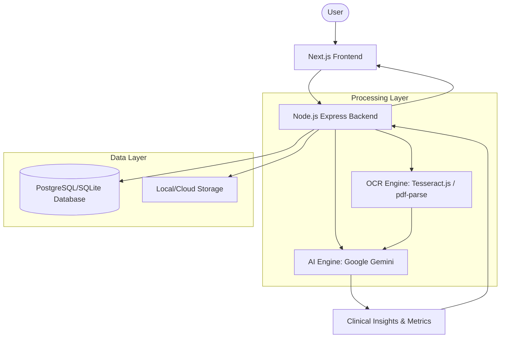

# Midiscanai — Medical Intelligence Platform

AI-powered medical report analysis built with Next.js, Node.js, and Google Gemini API (gemini-2.5-flash).

 
 
 
 
 


## Project Description

Midiscanai is a professional-grade medical intelligence platform designed to bridge the gap between complex clinical reports and patient understanding. By leveraging advanced OCR and AI reasoning, it provides instant, data-driven insights from scanned reports, helping users understand their health metrics in clear, actionable language.

The architecture is built for production environments, featuring a high-performance Next.js 14 frontend and a robust Node.js Express backend. It integrates Tesseract.js for image OCR, pdf-parse for medical documents, and Google Gemini (gemini-2.5-flash) for clinical reasoning. Data security is prioritised through HIPAA-compliant PII scrubbing and AES-256 encryption.

## Features

- ✅ **Secure Uploads**: Support for PNG, JPG, PDF, and TXT medical reports.
- ✅ **AI Analysis**: Deep clinical insights powered by Google Gemini.
- ✅ **OCR Engine**: Scanned image text extraction using Tesseract.js & Sharp.
- ✅ **PDF Extraction**: Multi-page text parsing with pdf-parse.
- ✅ **HIPAA Compliance**: Automatic PII scrubbing before AI processing.
- ✅ **Data Security**: AES-256-CBC encryption for sensitive stored data.
- ✅ **Authentication**: JWT-based secure login with email verification.
- ✅ **Audit Logging**: Comprehensive trail for sensitive system actions.
- ✅ **Visual Dashboard**: Color-coded risk scores and condition levels.
- ✅ **Cost Estimator**: Treatment estimates in Indian Rupees.
- ✅ **Responsive UI**: Fully optimized for mobile and desktop screens.
- ✅ **White-Label Branding**: Professional custom design with zero watermarks.

## Tech Stack

| Layer | Technology |
|---|---|
| **Frontend** | Next.js 14 + React + Tailwind CSS + Framer Motion |
| **Backend** | Node.js + Express.js |
| **AI Model** | Google Gemini 2.5 Flash via @google/generative-ai SDK |
| **OCR** | Tesseract.js + Sharp Image Preprocessing |
| **PDF Parsing** | pdf-parse |
| **Database** | PostgreSQL + Prisma ORM |
| **Auth** | JWT + bcryptjs |
| **Email** | Nodemailer |
| **File Upload** | Multer |
| **Deployment** | Vercel (Frontend) + Railway.app (Backend) |

## System Architecture



## Multi-Agent Architecture

Midiscanai uses a Multi-Agent AI system where specialized agents handle
distinct responsibilities. All agents are coordinated by the Orchestrator.

### Total Agent Count: 7

### Agent Roster

| Agent Name | File | Responsibility |
|---|---|---|
| OrchestratorAgent | `backend/src/agents/orchestrator.agent.js` | Central coordinator for the entire AI analysis pipeline, delegating tasks in sequence and collecting results. |
| ReportProcessingAgent | `backend/src/agents/reportProcessing.agent.js` | Handles file reading, text extraction, report type detection, and basic document validation. |
| DataPrivacyAgent | `backend/src/agents/dataPrivacy.agent.js` | HIPAA-compliant PII scrubbing before any medical text is sent to an external AI API. |
| MedicalAnalysisAgent | `backend/src/agents/medicalAnalysis.agent.js` | Calls the Google Gemini API with the scrubbed medical text and returns the raw structured analysis. |
| RiskAssessmentAgent | `backend/src/agents/riskAssessment.agent.js` | Validates, corrects, and enhances risk scores and ensures condition levels are consistent. |
| RecommendationAgent | `backend/src/agents/recommendation.agent.js` | Reviews medical analysis and risk results, generating/validating specific guidance and cost. |
| AuditAgent | `backend/src/agents/audit.agent.js` | Records a detailed non-blocking audit trail for every analysis request to the database. |

### Agent Communication Flow

```
Controller → OrchestratorAgent → ReportProcessingAgent
                             → DataPrivacyAgent
                             → MedicalAnalysisAgent
                             → RiskAssessmentAgent
                             → RecommendationAgent
                             → AuditAgent
                            ← Collects all results
Controller ← Final structured result
```

### Architecture Overview

The Multi-Agent design ensures separation of concerns — each agent has
one job, making the system easier to debug, test, and extend. The
Orchestrator coordinates all agents and is the only entry point from
the Express controller. No agent calls another agent directly except
through the Orchestrator's context object.

## Project Structure

```
MEDISCAN-AI/
├── frontend/
│   ├── src/
│   ├── public/
│   ├── package.json
│   └── vite.config.js  (or next.config.js)
│
├── backend/
│   ├── server.js  (or src/index.js)
│   ├── routes/
│   ├── models/
│   └── package.json
│
└── README.md
```


## Getting Started

### Terminal 1 — Start Backend
cd backend
npm install
npm run dev

### Terminal 2 — Start Frontend
cd frontend
pnpm install
pnpm run dev

### Open in Browser
http://localhost:3000

---

### 🧪 Testing the Analysis Flow

1.  **Upload**: Select a medical report (JPG, PNG, or PDF). 
    - *Note: Ensure the file size is between 10KB and 40MB.*
2.  **Analyze**: Click on the **Analyze Report** button.
3.  **Results**: Wait for the AI to process the document (usually 10-30 seconds). You will receive a detailed dashboard with color-coded risk metrics and clinical explanations.

## API Endpoints

| Method | Endpoint | Auth Required | Description |
|---|---|---|---|
| POST | `/api/auth/signup` | No | User registration |
| POST | `/api/auth/login` | No | User authentication |
| POST | `/api/upload` | No* | File upload (PNG/JPG/PDF/TXT) |
| POST | `/api/analyze` | No* | Trigger AI report analysis |
| GET | `/api/results/:id` | No* | Retrieve analysis findings |

*\* Auth required in production configuration.*

## Environment Variables

| Variable | Service | Required | Description |
|---|---|---|---|
| `GOOGLE_API_KEY` | Backend | Yes | Your Google AI API key from https://aistudio.google.com/apikey |
| `GEMINI_MODEL` | Backend | No | Gemini model to use (default: gemini-2.5-flash) |
| `DATABASE_URL` | Backend | Yes | PostgreSQL/SQLite URL |
| `SECRET_KEY` | Backend | Yes | JWT Signing Secret |
| `ENCRYPTION_KEY` | Backend | Yes | AES Encryption Hex Key |
| `NEXT_PUBLIC_API_URL` | Frontend | Yes | Backend API Endpoint |

---

### Troubleshooting
- **Analysis failed with 404 error**: This means the AI provider URL was wrong. If you migrated from OpenRouter, ensure `GOOGLE_API_KEY` is set and `OPENROUTER_API_KEY` is removed from `.env`.

---

*Designed by Aditya Air A Boy * 
**CREATED BY BMS**  
Licensed under MIT

